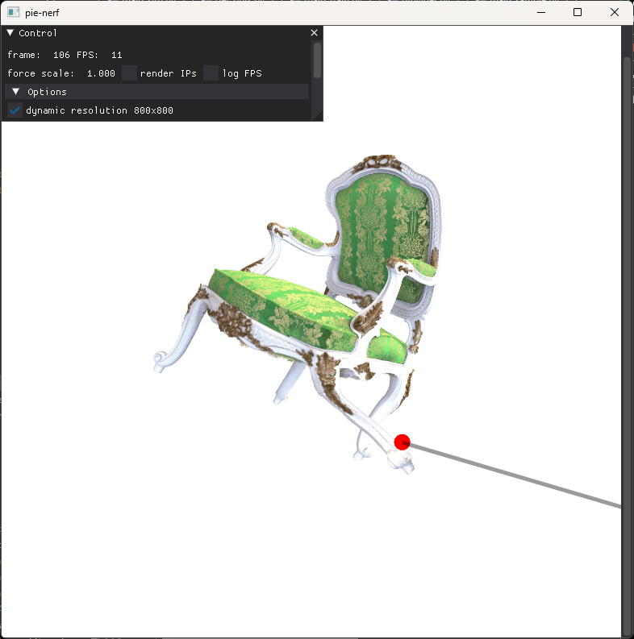

# PIE-NeRF🍕: Physics-based Interactive Elastodynamics with NeRF

### [[Project Page](https://fytalon.github.io/pienerf/)] [[arXiv](https://arxiv.org/abs/2311.13099)] [[Video](https://fytalon.github.io/pienerf/static/video/c_video.mp4)]

Yutao Feng<sup>1,2</sup>\*, Yintong Shang<sup>1</sup>\*, Xuan Li<sup>3</sup>, Tianjia Shao<sup>2</sup>, Chenfanfu Jiang<sup>3</sup>, Yin Yang<sup>1</sup> <br>
<sup>1</sup>University of Utah, <sup>2</sup>Zhejiang University, <sup>3</sup>University of California, Los Angeles <br>
*Equal contributions

Abstract: *We show that physics-based simulations can be seamlessly integrated with NeRF to generate high-quality elastodynamics of real-world objects. Unlike existing methods, we discretize nonlinear hyperelasticity in a meshless way, obviating the necessity for intermediate auxiliary shape proxies like a tetrahedral mesh or voxel grid. A quadratic generalized moving least square (Q-GMLS) is employed to capture nonlinear dynamics and large deformation on the implicit model. Such meshless integration enables versatile simulations of complex and codimensional shapes. We adaptively place the least-square kernels according to the NeRF density field to significantly reduce the complexity of the nonlinear simulation. As a result, physically realistic animations can be conveniently synthesized using our method for a wide range of hyperelastic materials at an interactive rate.*

## News

- [2024-03-12] Code Release.
- [2024-02-27] Our paper has been accpetd by CVPR 2024!

## Setup

The following setup is tested on Windows 11, with RTX 3060 and CUDA toolkit 11.8.

Our code is developed based on [torch-ngp](https://github.com/ashawkey/torch-ngp), a pytorch implementation of Instant-NGP.

### Cloning the Repository

```
git clone https://github.com/FYTalon/pienerf.git
```

### Python Environment

To prepare the Python environment needed to run PIE-NeRF, execute the following commands:
```shell
conda create -n pienerf python=3.10
conda activate pienerf
conda install ninja trimesh opencv tensorboardX numpy pandas tqdm matplotlib rich packaging scipy -c conda-forge
pip install imageio lpips torch-ema PyMCubes pysdf dearpygui torchmetrics
pip install torch==2.0.1 torchvision==0.15.2 torchaudio==2.0.2 --index-url https://download.pytorch.org/whl/cu118
pip install git+https://github.com/NVlabs/tiny-cuda-nn/#subdirectory=bindings/torch
pip install warp-lang==0.13.0 plyfile kornia
SET DISTUTILS_USE_SDK=1
# run the following line in each folder: raymarching, shencoder, gridencoder 
python setup.py build_ext --inplace && pip install .
```
For environment building issues, please check [torch-ngp](https://github.com/ashawkey/torch-ngp)'s issues first. 

## Run

**If you want skip training and sampling**, we provide several pretrained NeRF models and sampled point cloud files (with configs encoded) [here](https://drive.google.com/drive/folders/1gF56IjQpdXauV9gP8vbouRTnuwxR7mxa) for you to download. The directory should look like this

```
/pienerf
  /model
    /chair
      /checkpoints
        ngp_ep0300.pth
    /trex
      /checkpoints
        ngp_ep0625.pth
  /assets
    chair_0.ply
    trex_0.ply
...
main_gui.py
...
```

With these, you can directly go to section **Simulate and Render** below.

### Train (skippable)

You need to change argument `--path` to the actual path your dataset lies in. NeRF datasets can be downloaded [here](https://drive.google.com/drive/folders/128yBriW1IG_3NJ5Rp7APSTZsJqdJdfc1).

If you want to train your own NeRF model, you can run

e.g. for nerf synthetic data,

```
python main_train.py --dataset_type synthetic --path D:/Data/nerf_synthetic/lego --iters 30000 --W 800 --H 800 -O
```

For training other datasets, or creating your own dataset, as well as an explanation of arguments used here (such as `-O`), please refer to [torch-ngp](https://github.com/ashawkey/torch-ngp).

Trained results including checkpoints will be stored in the folder `model/`.

### Sample (skippable)

To simulate a reconstructed NeRF scene, you can use one of our provided point clouds [here](https://drive.google.com/drive/folders/1gF56IjQpdXauV9gP8vbouRTnuwxR7mxa). 

Or if you want to get a customized point cloud, you can run 

```
python sampling/point_sampling.py --dataset_type synthetic --workspace model/chair --exp_name chair_0  --sub_coeff 0.25 --sub_res 40
```

where the path `model/chair` should contain a file like `checkpoints/ngp*.pth`, and `sub_coeff` and `sub_res` controls the density of point cloud (see Section **Parameters** for details).

This will generated `chair_0.ply`in the folder `model/chair`.

Then, edit vertex attributes using 3D software such as Houdini, or edit the ply file as a text, to assign values for attributes `pin`, `lam`, `mu` and `mass`.

Explanation of point attributes:

- `vp`: volume of each point, calculated and written when running `point_sampling.py`.

The following attributes need to be specified by your self:

- `pin`: int, 1 or 0, where 1 means pinned. 
- `lam` & `mu`: float, material parameters, typically 1e6.
- `mass`: float, mass of each vertex, typically 1e3*`vp`.

Note: for real-world dataset, you need to first determine the bounding box of the object you want to simulate, and then set it by `--cut --cut_bounds `, where `--cut_bounds` are a list of floats ( x_min 

e.g. for `nerf_llff_data/trex`, you can run

```
python sampling/point_sampling.py --workspace model/trex --exp_name trex_0 --sub_coeff 0.75 --sub_res 180 --density_threshold 0.04 --cut --cut_bounds -0.62 1.0 -0.82 0.42 -0.52 0.28
```

### Simulate and Render

Saving edited `chair_0.ply` into folder `model/chair`, and run

```
python main_gui.py --path D:/Data/nerf_synthetic/chair --dataset_type synthetic --workspace model/chair --exp_name chair_0 -O --max_iter_num 1 --num_seek_IP 3 --sim_dx 0.05
```
It can be slow for the first-time run, because Warp CUDA kernel compiling takes some time (5 to 10 minutes). After first compiling, it should be faster (a few seconds).

Press space to start simulation (or press again to pause). Left click on the object while ctrl is pressed to add force. Press key Q or right click to stop force. Scroll your mouse while force is in effect to change the force scale.



Also pass in `--cut --cut_bounds` if you use these bounds in sampling, e.g.

```
python main_gui.py --path D:/Data/nerf_llff_data/trex --workspace model/trex --exp_name trex_0 -O --max_iter_num 1 --num_seek_IP 1 --sim_dx 0.05 --cut --cut_bounds -0.62 1.0 -0.82 0.42 -0.52 0.28 --max_steps 300 --T_thresh 5e-2 --W 1008 --H 756
```

In this case, objects inside cut bounds are simulated and rendered using ray bending, while the rest is rendered as a static background.


### Parameters
Key command line parameters include:

- Shared Parameters:
  - `path`: the path to NeRF dataset, the directory containing transfom*.json
  - `dataset_type`: used only for NeRF synthetic data, `--dataset_type synthetic` is equivalent to to setting `--scale 0.8 --bound 1.0 --dt_gamma 0.0 --W 800 --H 800`.
  - `workspace`: directory of saved checkpoints
  - `exp_name`: customizable experiment name

- Point Sampling Parameters:
    - `sub_coeff`: The bigger, the more boundary points sampled.
    - `sub_res`: The bigger, the more grid points sampled.
    - `density_threshold`: If NeRF's density is larger than this this, it is considered occupied.
- Simulation Parameters:
    - `sim_dt`: time step
    - `sim_dx`: control the density of IPs
    - `sim_iters`: number of local-global steps
    - `sim_stiff`: strength of boundary condition
- Rendering Parameters:
    - `max_iter_num`: For quadratic ray bending. The maximum number of of Newton iterations when solving for the rest shape position. More iterations give (potentially) better rendering quality and slower rendering speed.
    - `num_seek_IP`: For quadratic ray bending. The number of IPs to seek for each query point. Valid values are 1, 2, 3. The rest position will be weighted sum of rest positions calculated by these IPs.
    - `sim_dx`: spatial hashing grid size.
    - `max_steps`, `T_thresh`: NeRF rendering settings. 
    
## TODO
- Add more pretrained models.
- Add collision
- Add point cloud edit GUI.

## Citation

```
@misc{feng2023pienerf,
      title={PIE-NeRF: Physics-based Interactive Elastodynamics with NeRF}, 
      author={Yutao Feng and Yintong Shang and Xuan Li and Tianjia Shao and Chenfanfu Jiang and Yin Yang},
      year={2023},
      eprint={2311.13099},
      archivePrefix={arXiv},
      primaryClass={cs.CV}
}      
```